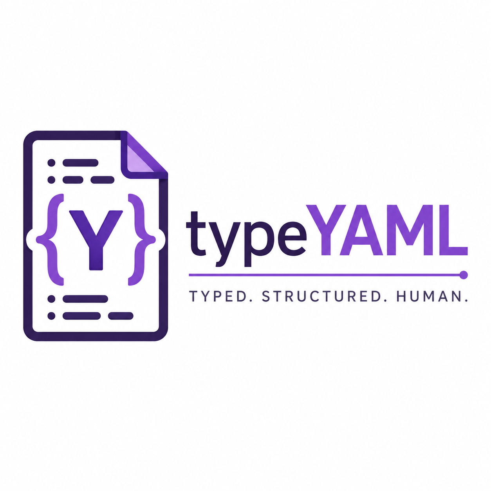
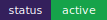
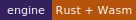

<p align="center">
  
</p>

<p align="center"><strong>Typed. Structured. Human.</strong></p>

<p align="center">
  
  
  
  <a href="docs/index.md"></a>
  <a href="LICENSE"></a>
</p>

# typeYAML

typeYAML (`.taml`, CLI: `taml`, symbol: 🦣) is a compile-time language for reliable configuration. It adds interfaces, primitive types, enums, defaults, inheritance, constraints, reusable standard schemas, source maps, and editor intelligence—then produces ordinary YAML or JSON for the tools teams already run.

It has no deployment runtime. Your Kubernetes cluster, CI provider, Terraform workflow, or other consumer receives normal YAML/JSON; typeYAML catches configuration mistakes before those systems do.

**Documentation:** [Getting started](docs/guide/getting-started.md) · [Language specification](docs/guide/spec.md) · [CLI guide](docs/guide/cli.md) · [IDE and registry](docs/guide/ide.md) · [Native engine](docs/guide/native-engine.md)

## Project at a glance

TypeYAML is a complete configuration toolchain, not a YAML runtime or a new deployment platform. Authors write typed `.taml` source; the compiler proves the pieces it understands are safe; existing tools receive regular YAML or JSON.

| Layer | What it does | Main entry point |
| --- | --- | --- |
| Language | Interfaces, scalar types, enums, defaults, constraints, inheritance, and imports | `.taml` files |
| Compiler | Lexes, parses, validates, resolves imports, emits YAML/JSON, and writes source maps | `taml check` / `taml build` |
| Native engine | Rust implementation for the standalone CLI, N-API bridge, and WebAssembly consumers | `cli-rust`, `crates/taml-core` |
| SDK | Programmatic TypeScript API with automatic native/TypeScript engine selection | `import { compile } from "@magnexis/typeyaml"` |
| Developer experience | Formatter, linter, source maps, LSP, VS Code syntax support, and project diagnostics | `taml fmt`, `taml lint`, `taml-lsp` |
| Schema ecosystem | Built-in infrastructure schemas plus remote, locked, cached imports | `std/k8s`, `taml.lock` |
| Delivery | Docs, tests, release workflows, package metadata, checksums, and attestations | `docs/`, `.github/workflows/` |

The local badges above deliberately use committed SVG assets instead of public service URLs. They render in forks, offline documentation previews, and repositories before the NPM package or GitHub Actions workflow has been published.

## Why typeYAML

```taml
interface ProductionDatabase:
  host: String(pattern: "^[a-z0-9.-]+$")
  port: Int(min: 1024, max: 65535)

component "payments-db" implements ProductionDatabase:
  host: "db.internal"
  port: 80
```

`taml check` reports that `80` violates the port range—locally, immediately, and with a source location. Correct it to `5432`, then compile standard YAML:

```yaml
# Generated by typeYAML — DO NOT EDIT DIRECTLY
host: db.internal
port: 5432
```

## Install and run

The repository supports two development paths today.

```sh
# TypeScript wrapper / SDK
npm install
npm run build
node dist/cli/index.js check examples/payment-api.tyaml

# Standalone native CLI
cargo build --release -p taml
./target/release/taml check examples/payment-api.tyaml

# Create a new project interactively
./target/release/taml init my-service
```

When the package is published, install the wrapper with `npm install -g @magnexis/typeyaml`. Tagged releases also build standalone native binaries for Linux x64/ARM64, macOS Intel/Apple Silicon, and Windows x64.

## The everyday workflow

1. Run `taml init` to create a starter source file and registry policy.
2. Define a contract with an `interface`, then create one or more `component` instances.
3. Use editor diagnostics, `taml check`, `taml fmt --check`, and `taml lint` before committing.
4. Run `taml build` in CI to generate ordinary YAML or JSON and a source-map sidecar.
5. Deploy the generated file with the platform you already use. There is no TypeYAML agent, server, or runtime in production.
6. Pin shared schemas in `taml.lock`; verify them with `taml lock --verify` for reproducible and offline builds.

This keeps the source-of-truth ergonomic for people while preserving compatibility with every YAML/JSON consumer downstream.

## 30-second example

```taml
interface DatabaseConfig:
  host: String
  port: Int(min: 1024, max: 65535)
  environment: "production" | "staging" | "development"
  max_connections: Int = 100

component BaseService:
  replicas: 3
  health_check: "/health"

component "payment-api" extends BaseService implements DatabaseConfig:
  host: "db.internal.net"
  port: 5432
  environment: "production"
```

```sh
taml check payment-api.taml
taml build payment-api.taml --output generated
```

The child component inherits `replicas` and `health_check`; the interface injects `max_connections`; all required fields and constraints are validated. Each generated file also receives a `.yaml.map` or `.json.map` sidecar that maps emitted keys back to `.taml` source positions.

## The language

### Declarations

| Declaration | Purpose |
| --- | --- |
| `interface Name:` | A named structural contract with typed properties. |
| `component Name:` | A reusable component or compiled output document. |
| `component Child extends Parent` | Inherits parent values; child values override them. |
| `component App implements Contract` | Validates a component against an interface and injects interface defaults. |
| `import { Name } from "…"` | Imports standard or registry-backed interfaces. |

### Types and values

| Syntax | Meaning |
| --- | --- |
| `String` | Text value. |
| `Int` | Integer. |
| `Float` | Numeric value. |
| `Boolean` | `true` or `false`. |
| `"dev" \| "prod"` | String enum / literal union. |
| `field?: Type` | Optional interface property. |
| `field: Type = value` | Interface default. |
| `field: value` | Component value. |

### Constraints

```taml
interface Service:
  port: Int(min: 1, max: 65535)
  host: String(pattern: "^[a-z0-9.-]+$")
  environment: "dev" | "staging" | "production"
```

`min` and `max` constrain numeric values. `pattern` uses a regular expression for strings. Enum values must exactly match one declared literal. Required fields without defaults must be supplied by the component or its parent.

### Compilation semantics

1. Imports resolve before validation.
2. Parent component values are inherited.
3. Interface defaults are applied for missing fields.
4. Explicit child values win.
5. Types, enums, patterns, and numeric bounds are checked.
6. One YAML or JSON document is emitted for every component.

The current stable grammar focuses on scalar configuration fields. Nested object/list parity and raw-YAML escape hatches are active development work; see the language spec for the current boundary.

## CLI reference

| Command | Description |
| --- | --- |
| `taml check <file.taml>` | Parse, resolve imports, and validate a source file. It also checks generated YAML/JSON syntax and traces sidecar maps. |
| `taml build <file.taml> -o <path>` | Compile to YAML plus source-map sidecars. |
| `taml build <file.taml> -f json` | Compile to formatted JSON plus source-map sidecars. |
| `taml build <file.taml> --stdout` | Write one compiled component to standard output for pipes and CI. |
| `taml watch <file.taml>` | Rebuild after changes. |
| `taml init [directory]` | Create a starter `.taml` project and safe registry configuration. |
| `taml doctor` | Report CLI, cache, language-server, and setup information. |
| `taml import <legacy.yaml> --out <file.taml>` | Infer a starter interface/component from YAML or JSON. |
| `taml fmt <file.taml> [--check]` | Apply or validate canonical formatting. |
| `taml lint <file.taml>` | Run static configuration-quality rules. |
| `taml-lsp` | Start the Language Server Protocol server over stdio. |

`taml lint` currently provides `no-unused-interfaces`, `no-redundant-defaults`, and `require-string-constraints`. `taml fmt` normalizes two-space indentation, key/value spacing, inline constraint spacing, and top-level interface ordering.

## Standard library and registry

Use built-in infrastructure schemas without duplicating definitions:

```taml
import { Deployment } from "std/k8s"

component "payments" implements Deployment:
  name: "payments"
  image: "registry.example/payments:1.0"
  replicas: 3
```

Built-ins include `std/k8s` (`Deployment`, `Service`, `Ingress`), `std/github-actions` (`Workflow`, `Job`, `Step`), and `std/docker-compose` (`ComposeService`).

Remote schemas use HTTPS or immutable GitHub references:

```taml
import { Deployment } from "https://registry.typeyaml.org/k8s/v1.28"
import { Service } from "github:typeyaml/stdlib@v1.0.0/k8s"
```

Resolved content is SHA-256 pinned in `taml.lock` and cached under `~/.taml/cache`. Use `.tamlrc.json` to require HTTPS and allow only approved hosts; copy [`.tamlrc.example.json`](.tamlrc.example.json) to start.

```sh
taml lock --verify
```

Run this before offline or release builds to ensure every locked schema exists locally and still matches its recorded SHA-256 digest.

## Editor support

Install the official [TypeYAML VS Code extension](https://marketplace.visualstudio.com/manage/publishers/magnificent-language/extensions/typeyaml-vscode/hub) for `.taml` syntax highlighting and `taml-lsp` integration, including diagnostics, completion, hover, definition lookup, local rename, and semantic tokens. Set `typeyaml.languageServer.path` when the native language server is not already on `PATH`. The extension source lives in [vscode-extension](vscode-extension); package a development VSIX with `cd vscode-extension && npm install && npm run package`. The prior [editors/vscode](editors/vscode) location remains available for compatibility.

The LSP speaks standard stdio JSON-RPC, so it can also be configured in Neovim, Zed, Helix, and other LSP-compatible editors.

## JavaScript / TypeScript SDK

```ts
import {
  check,
  compile,
  parseAST,
  nativeEngineStatus
} from "@magnexis/typeyaml";

const ast = parseAST(source);
const checked = check(source);
if (!checked.valid) console.error(checked.errors);

const yaml = await compile(source, {
  format: "yaml",
  component: "payment-api",
  engine: "auto" // "auto" | "native" | "typescript"
});

console.log(await nativeEngineStatus());
```

The option-based SDK prefers the optional N-API engine for the supported native grammar and falls back to TypeScript where necessary. `compileFileWithNative()` is available for native, registry-aware compilation from a file/project context.

## Native architecture

The project is a monorepo:

- `crates/taml-core` — Rust lexer, parser, checker, emitter, source maps, and registry resolver.
- `cli-rust` — standalone native `taml` binary.
- `crates/typeyaml-napi` and `packages/node-core` — N-API bridge and platform package metadata.
- `crates/typeyaml-wasm` — WebAssembly bridge for browser/editor use.
- `crates/taml-fmt` and `crates/taml-lsp` — formatter/linter and language server.
- `src/` — TypeScript SDK, compatibility compiler, registry, and CLI wrapper.

On the included native benchmark fixture, the release CLI measured a 4.004 ms median and 4.531 ms p95 over 30 local Windows x64 launches. Rerun `npm run native:benchmark` on each target before making performance claims for that environment.

## Automation, quality, and security

- `npm test` — TypeScript compiler tests.
- `cargo test -p taml-core` — native compiler tests.
- `cargo test -p taml-lsp` — JSON-RPC LSP integration test.
- `npm run docs:build` — VitePress documentation build.
- `.pre-commit-hooks.yaml` — Python `pre-commit` integration.
- `examples/husky-pre-commit` — Husky example.
- GitHub Actions validate TypeScript, native builds, docs, fuzzing, formatting, linting, native releases, provenance attestations, checksums, and VSIX packaging.

Tagged releases are assembled by one canonical [release workflow](.github/workflows/release.yml). It publishes the Node package and attaches all native CLI, N-API, Wasm, VS Code, documentation, checksum, manifest, and provenance artifacts to the GitHub Release. See [RELEASE.md](RELEASE.md) for the exact artifact inventory and verification procedure.

Registry host policy, immutable GitHub revisions, checksums, provenance attestations, and scheduled parser fuzzing are included. Review [the contribution and release guide](docs/guide/contributing.md) before publishing a release.

## Repository map

See [PROJECT_STRUCTURE.md](PROJECT_STRUCTURE.md) for the complete directory layout.

## Status and contributing

typeYAML is actively evolving. The scalar typed-configuration workflow, native CLI, formatter/linter, registry locking, source maps, LSP, and standard schemas are implemented. Broader nested-manifest parity, release-install smoke testing, and additional IDE refactors are the next areas of investment.

Contributions are welcome under the [MIT License](LICENSE).
